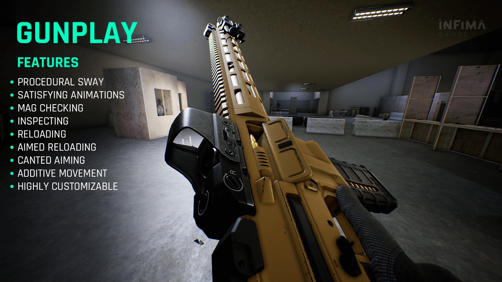

# RART - Realistic Assault Rifle Template

The Realistic Assault Rifle Template is a fully customizable Unreal Engine 5 FPS template featuring a game-ready assault rifle, modular attachments, professional animations, and a robust FPS Blueprint system - providing a strong foundation and giving you full control over animations, weapon behavior, and movement.

It handles the core FPS foundations - realistic movement, shooting mechanics, animations, and weapon setup - so you can focus on designing your own gameplay.

**Note:** The template is made in Unreal Engine 5.0, but it works with any version from 5.0 all the way up to 5.6 (at the time of writing this).

[Try the demo here!](https://infimagames.gumroad.com/l/demo-realistic-assault-rifle-pack)

[Watch the trailer here!](https://www.youtube.com/watch?v=TNIutG89VlU)

## Key Features

### Game-Ready Assault Rifle Model
Detailed, realistic assault rifle model built for FPS gameplay.
Includes modular attachments: scope, laser, suppressor, and grips.
Easily customizable materials for creating unique weapon skins.

### High-Detail First-Person Arms & Gear
Realistic first-person arms rigged to the UE5 Mannequin skeleton.
Comes with gloves, wristwatch, and detailed shirt sleeves.

### Advanced FPS Movement System
Walking, sprinting, tactical sprint, crouching, prone, sliding, vaulting, jumping.
Fully animated, responsive movement for smooth modern FPS controls.

### Complete Weapon Blueprint System
Procedural recoil with customizable patterns.
Dynamic crosshairs, physical shell casings, muzzle flashes, and weapon sway.
Inspection animations, magazine check system, and canted aiming functionality.

### AAA-Quality Animations
Professional-level shooting, reloading, melee, and movement animations.
Designed to feel smooth and polished, just like top-tier FPS titles.
Fully compatible with any UE5 Manny-rigged character for fast retargeting.

### Grenade Throwing System
Quick throw, long throw, and hold-to-throw functionality.
Includes realistic VFX, impactful sound effects, and ground decals.

### Destructible Props & Example Tutorial Map
Comes with a playable demo map featuring destructible assets.
Perfect for testing weapon mechanics and serving as a level design reference.

## Download

Get the Realistic Assault Rifle Template from these platforms:

- **[Epic Games FAB](https://www.fab.com/listings/05dbb53b-d75f-4a08-bcc2-fc02de484866)**
- **[Gumroad](https://infimagames.gumroad.com/l/realistic-assault-rifle-template)**

## Resources

- **[Documentation](https://infimagames.notion.site/Realistic-Assault-Rifle-Template-8228fd0833f4493fb34a21ffa2035ae6)** - Complete setup and usage guide
- **[YouTube Channel](https://www.youtube.com/@InfimaGames)** - Video tutorials and development insights
- **[Discord Server](https://discord.com/channels/878295873614934016/878295873614934020/886926092626182175)** - Community support and discussions

## Support

Need help getting started or have questions about implementation?

**Join our Discord server** - our team and community members are here to help you make the most of your FPS project.

## License

This repository serves as a project showcase and does not contain the actual template assets or code. 

License terms depend on where you purchase the template. Review the specific license agreement provided by your chosen marketplace (FAB or Gumroad) for complete licensing details.
